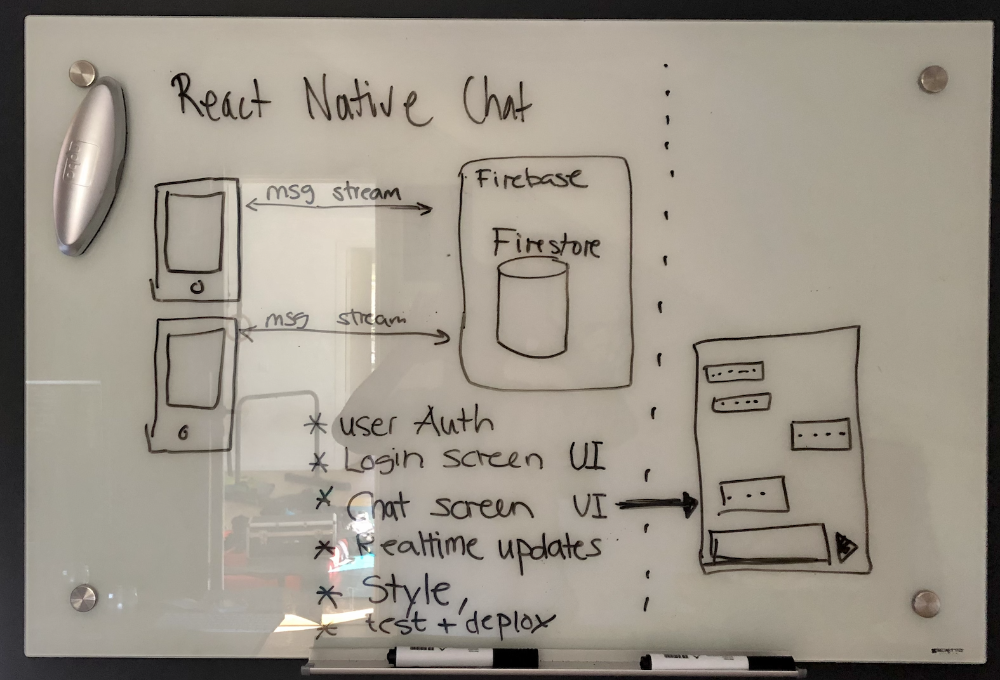
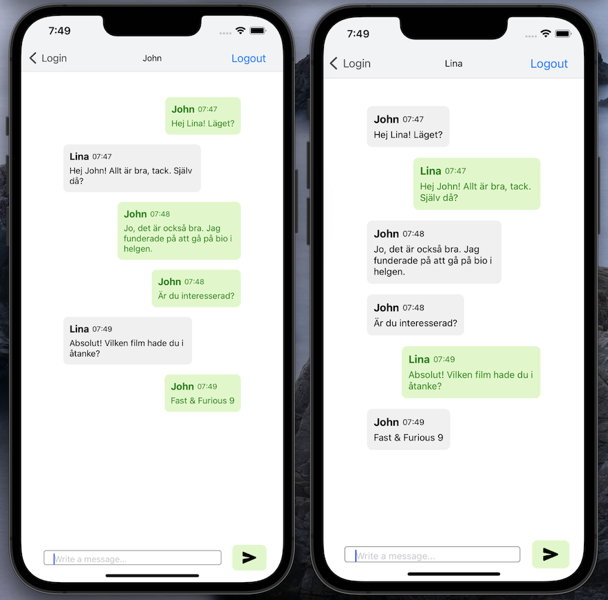

# React Native Chat App

This is a simple chat application built with React Native with Expo. It allows users to send and receive messages in real-time.
Application contains a infinite-scroll that retrive new messages when user executes a scroll-up gesture on the screen.

## Design



## Technologies Used

- React Native
- Firebase Firestore
- Expo

## Prequisite

1. Node.js >= v16.13.1
2. Yarn >= 1.22.17
3. Expo => 6.3.7

Optional:
1. Java, https://sdkman.io/
2. Firestore emulator, https://rnfirebase.io/firestore/emulator#running-the-emulator

## Installation

1. Clone the project

```bash
git clone <REPO_NAME>
```

2. (*Optional*) Start the firestore emulator

```bash
firebase emulators:start --only firestore
```

3. Run the project

```bash
npx expo install
npx expo start # if not using local emulator add: -no-dev --minify
```

4. Use the Expo Go app to test the app on your mobile device or use an emulator.

## Screenshots



## Next steps:

- Tests
- Error handling & reporting *(ie. message delivery)*
- Firebase Authentication
- Chat message layout
- UI Design revamp *(standardize theme fonts & colors)*
